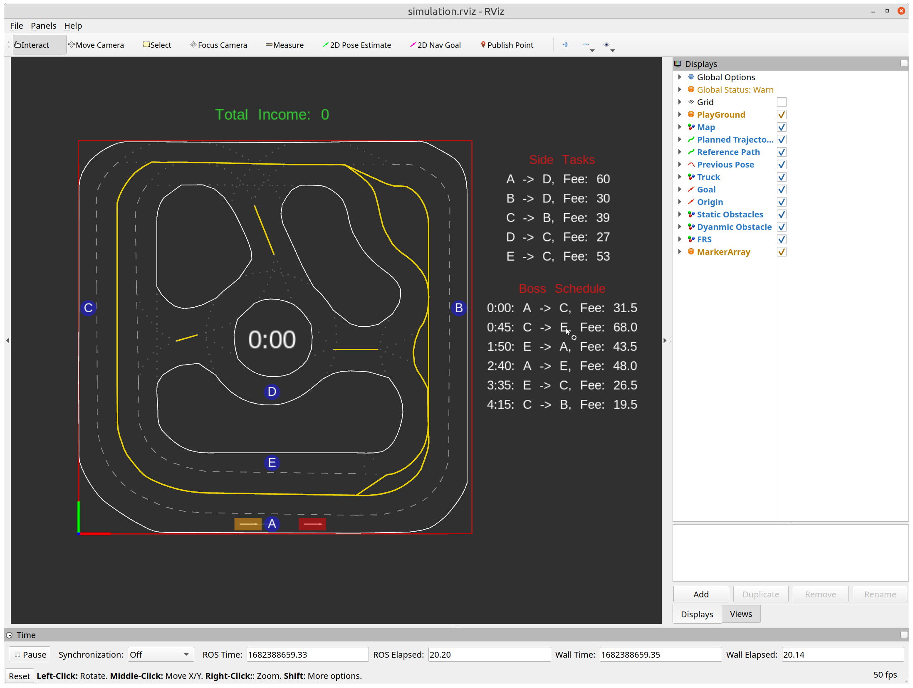

# Final Project Hints

# Plan a reference path from a point to another point
The easiest way to plan a reference path is call the ROS service "/routing/plan" provided in racecar_routing package. For example

```python
import rospy
from racecar_routing.srv import Plan, PlanResponse, PlanRequest
from You_Need_to_Define_the_import_Path_Here import RefPath

rospy.wait_for_service('/routing/plan')
plan_client = rospy.ServiceProxy('/routing/plan', Plan)

x_start = # x coordinate of the start
y_start = # y coordinate of the start

x_goal = # x coordinate of the goal
y_goal = # y coordinate of the goal

plan_request = PlanRequest([x_start, y_start], [x_goal, y_goal])
plan_response = plan_client(plan_request)

# The following script will generate a reference path in [RefPath](scripts/task2_world/util.py#L65) class, which has been used in your Lab1's ILQR planner
x = []
y = []
width_L = [] ## bounds on road
width_R = []
speed_limit = []

for waypoint in plan_respond.path.poses:
    x.append(waypoint.pose.position.x)
    y.append(waypoint.pose.position.y)
    width_L.append(waypoint.pose.orientation.x)
    width_R.append(waypoint.pose.orientation.y)
    speed_limit.append(waypoint.pose.orientation.z)
            
centerline = np.array([x, y])

# This is the reference path that we passed to the ILQR planner in Lab1
ref_path = RefPath(centerline, width_L, width_R, speed_limit, loop=False)
```

You can find the ***RefPath*** class in [***scripts/task2_world/util.py***](scripts/task2_world/util.py#L153) file. Just copy the class to your own file or link it to this file.
# Task 2:
## Launch Task 2
After rebuild the workspace, you can launch the task 2 world in simulation by
```bash
roslaunch final_project task2_simulation.launch
```
You will see both Rviz and RQT showing up. In Rviz, you can see the position of the ego car (yellow), Boss (red), elapsed time in the middle, total income on the top, currently available side tasks, and Boss's schedule on the side.


## Start the session
You will need to call the ROS service "/SwiftHaul/Start" to start the session. For example:
```python
import rospy
from std_srvs.srv import Empty, EmptyRequest, EmptyResponse

# set up the service client
client = rospy.ServiceProxy('/SwiftHaul/Start', Empty)

# call the service
client(EmptyRequest())
```
After the session starts, the elapsed time will starts to count, and the Boss will start to move. 

## Get Warehouse Information
All the warehouse information is stored in the [***task2.yaml***](task2.yaml) message. You can load them use the following script:
```python
with open(FILE_PATH_HERE, "r") as stream:
    warehouse_info = yaml.safe_load(stream)
```
We consider the truck is in the warehouse when it is less than 0.5 meters away in longitudinal direction and 0.25 meters away in lateral direction. 


## Get Boss Schedule
In addition to the displayed Boss schedule on Rviz, you can also get the full schedule through the ROS service "/SwiftHaul/BossSchedule". For example:
```python
import rospy
from final_project.srv import Schedule, ScheduleRequest, ScheduleResponse

# set up the service client
client = rospy.ServiceProxy('/SwiftHaul/BossSchedule', Schedule)

# call the service
respond = client(ScheduleRequest())
```
The respond of this [***Schedule*** service](srv/Schedule.srv) has four fields:
```python
respond.start_warehouse # List[int], the index of the warehouse that the Boss starts at

respond.goal_warehouse # List[int], the index of the warehouse that the Boss heading to

respond.reward # List[float], the reward of Boss Tasks

respond.schedule # List[float], the time that the Boss will depature for the task
```
## Get Currently Available Side Task
You can request to complete a Side Task by calling the ROS service "/SwiftHaul/SideTask". For example:
```python
import rospy
from final_project.srv import Task, TaskRequest, TaskResponse

# set up the service client
client = rospy.ServiceProxy('/SwiftHaul/SideTask', Task)

# call the service
respond = client(TaskRequest())
```
The respond of this [***Task*** service](srv/Task.srv) has three fields:
```python
respond.task # int, the index of the goal warehouse for your task. If the task is -1, it means there is no available task
respond.reward # float, the reward of the current tasks
```
If you want to complete the assigned side task, you can start plan immediately and drive as fast as possible for the side task. You can use the "/routing/plan" service to plan a reference path from your current position to the goal warehouse. 

If you do not like the current available task, you can request a new task by calling the service again. The Side Task will be refreshed every 5 seconds. After refreshing, the previous task will be gone.


## Get Currently Available Boss Task
You can request to complete a Boss Task by calling the ROS service "/SwiftHaul/BossTask". For example:
```python
import rospy
from final_project.srv import Task, TaskRequest, TaskResponse

# set up the service client
client = rospy.ServiceProxy('/SwiftHaul/BossTask', Task)

# call the service
respond = client(TaskRequest())
```
The respond of this [***Task*** service](srv/Task.srv) is same as the Side Task service above.

If you decide to take the task, you can start to plan your path to the goal warehouse. You can use the "/routing/plan" service to plan a reference path from your current position to the goal warehouse. 

**The Boss Task is only available within the 5 seconds window after the Boss departs from the warehouse.** If you don't take the task within the 5 seconds window, the task will be gone.

**Your truck have to follow the boss truck (no overtaking) if you decide to do the Boss Task.** Otherwise, you session will be considered invalid.

**You can abandon the Boss Task at any time,** by requesting a new Side Task at any warehouse. You may do another Boss Task next time when the Boss departs from the warehouse.

## Complete the Task and Collect the Reward
After you complete the task, you can call the ROS service "/SwiftHaul/GetReward" to collect the reward. For example:
```python
import rospy
from final_project.srv import Reward, RewardRequest, RewardResponse

# set up the service client
client = rospy.ServiceProxy('/SwiftHaul/GetReward', Reward)

# call the service
respond = client(RewardRequest())
```
The respond of this [***Reward*** service](srv/Reward.srv) has two fields:
```python
respond.done # bool, the status of the task. If the task is done, it will be True
respond.total_reward # float, the total reward of so far
```
